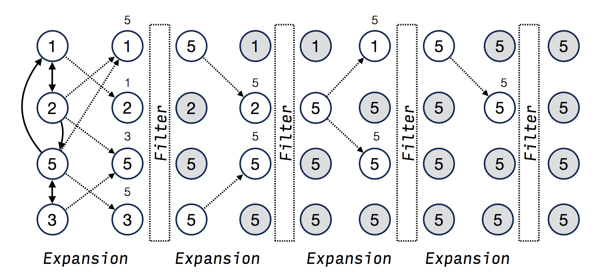
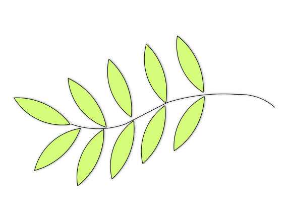

# Olive: A Lightweight Graph Processing Framework for Multi-GPUs

## Input Format

The Olive framework support two kinds of data format for the input graph: the *edge-list-file* format and the *dimacs* format. Users can read the corresponding graph file by calling two built-in APIs: `fromEdgeListFile()` and `fromDimacsFile()`.

### Edge-list-file

Each line in an edge list file represents a directional edge in the graph. More specifically, each line in the file contains two integers: a source vertex id and a target vertex id, and an optional edge-associated value. Lines that begin with `#` are treated as comments. For example:

    # Comment Line
    # SourceId  TargetId  <EdgeValue>
    1    5    <0.5>
    1    2    <0.2>
    1    8    <0.9>

### Dimacs (Metis)

This format is borrowed from the Dimacs 10th Challenge which can be referred to [http://www.cc.gatech.edu/dimacs10/downloads.shtml](http://www.cc.gatech.edu/dimacs10/downloads.shtml)

## Running

Olive provides a handful of input examples (located in `/data`) for quick run.You can run the applications on them by typing:

    $./PageRank ./data/gridGraph_15 

For some applications, like BFS, a `-s` flag (followed by an integer to indicate the source vertex) is also necessary. For example:

    $./BFS ./data/maxflowGraph_100 -s 24

## Olive Abstraction

According to Olive's abstraction, computation in a graph algorithm can be divided into two phases: a edge expansion phase and a vertex contraction phase. In edge expansion phase, edge-oriented computation is conducted to expand edges from a subset of vertices in the graph. And in the vertex contraction phase, vertex-oriented compuation is conducted to contract the vertex subset to a smaller one.

The following figure illustrates these concepts using a simple example: given a strongly connected graph where each node contains a value, it propagates the largest value to every vertex. 
Initially, all vertices in the graph is in the vertex-frontier. In the edge expansion phase, each vertex in the vertex-frontier writes its value to the accumulator of its neighbors only if the value is greater than the accumulator. All their destination vertices will be put into the edge-frontier.
In the vertex contraction phase, every vertex in the edge-frontier checks whether its value is less than the value cached in the accumulator, if so, puts itself into the vertex-frontier for the next iteration. The process repeats until the vertex-froniter becomes empty.

### C++ API

The framework encapsulates all details in a `Olive` class. Its template arguments define three value types, associated with vertices, edges, and accumulators. Writing an graph application with Olive is just invoking the method of the class. The underlying runtime system deals with everything, including memory management, communication and synchronization.

    template<typename VertexValue,
             typename EdgeValue,
             typename AccumValue>
    class Olive {
     public:
        template<typename F>
        void edgeFilter(VertexSubset &destVset, const VertexSubset &srcVset, F f);

        template<typename F>
        void edgeMap(const VertexSubset &srcVset, F f);

        template<typename F>
        void vertexFilter(VertexSubset &destVset, const VertexSubset &srcVset, F f);

        template<typename F>
        void vertexMap(const VertexSubset &srcVset, F f);

        void readGraph(const CsrGraph<int, int> &graph);
        VertexId getVertexCount() const;
    };

In edge expansion phase, an **edgeFilter** function is used to compute and collect the information along the outgoing edge of a vertex. The collected value will be cached temporarily in the destination vertex (in *accumulator*). The user can further use it in vertex contraction phase. This function mainly exploits the edge-level parallelism in the graph.

More specifically, **edgeFilter** takes a user-defined struct *F* as input. The struct *F* contains a pair of functions *gather* and *reduce* (isomorphic to *map* and *reduce*). The *gather* function computes a value (a user defined type) for each directional edge in the graph. The *reduce* function takes the value and performs a logical sum operation on the *accumulator*. So the operator must be commutative and associative.

    struct F {
        AccumValue gather(const VertexValue &srcV, EdgeId outNghNums, EdgeValue &e) {
            // ...
        }
        void reduce(AccumValue &accumulator, AccumValue accum) {
            // ...
        } 
    };

**vertexFilter** is defined within the vertex contraction phase. It is used to perform vertex-wise computation and mainly exploit the vertex-level parallelism. It performs computation based on the vertex state and the formerly cached accumulator.

More specifically, **vertexFilter** takes as input a *cond* function and a *update* function. The *cond* function takes the vertex local state (including the vertex ID) as input and return a boolean value. The *update* function updates the local vertex state with the formerly cached accumulator. 
**vertexFilter** filters the vertex into another vertex subset if and only if the *cond* function returns *true*.

    struct F {
        bool cond(const VertexValue &v) {
            //...
        }
        void update(VertexValue &v, AccumValue accum) {
            //...
        }
    }

## Partition Strategy

The graph in Olive is edge-cut. Olive currently supports the random edge-cut partition strategy. 

## Logo

