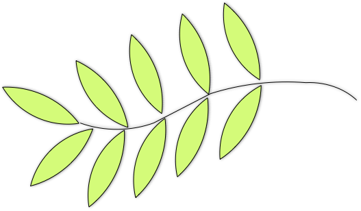

# Olive: A Lightweight Graph Processing Framework for Multi-GPUs

## Input Format

The Olive framework support two kinds of data format for the input graph: the *edge-list-file* format and the *dimacs* format. Users can read the corresponding graph file by calling two built-in APIs: `fromEdgeListFile()` and `fromDimacsFile()`.

### Edge-list-file

Each line in an edge list file represents a directional edge in the graph. More specifically, each line in the file contains two integers: a source vertex id and a target vertex id, and an optional edge-associated value. Lines that begin with `#` are treated as comments. For example:

    # Comment Line
    # SourceId  TargetId  <EdgeValue>
    1    5    <0.5>
    1    2    <0.2>
    1    8    <0.9>

### Dimacs (Metis)

This format is borrowed from the Dimacs 10th Challenge which can be referred to http://www.cc.gatech.edu/dimacs10/downloads.shtml

## Running

Olive provides a handful of input examples (located in `/data`) for quick run.You can run the applications on them by typing:

    $./PageRank ./data/gridGraph_15 

For some applications, like BFS, a `-s` flag (followed by an integer to indicate the source vertex) is also necessary. For example:

    $./BFS ./data/maxflowGraph_100 -s 24

## Olive Abstraction

According to Olive's abstraction, computation in a graph algorithm can be divided into two scopes: the edge scope and the vertex scope.  

### Edge Scope

In the edge scope, an **edgeMap** function is used to compute and collect the information from the neighbors of a vertex. The collected value will be cached temporarily in the destination vertex (in *accumulator*). The user can further use it in vertex scope. This function mainly exploits the edge-level parallelism in the graph.

**edgeMap** takes a user-defined struct *F* as input. The struct *F* contains a pair of functions *gather* and *reduce* (isomorphic to *map* and *reduce*). The *gather* function computes a value (a user defined type) for each directional edge in the graph. The *reduce* function takes the value and performs a logical sum operation on the *accumulator*. So the operator must be commutative and associative.

    struct F {
        __device__ inline AccumValue gather(VertexValue srcValue, EdgeId outNeighbors) {
            // ...
        }
        __device__ inline void reduce(AccumValue &accumulator, AccumValue accum) {
            //...
        } 
    };

### Vertex Scope

Two functions **vertexMap** and **vertexFilter** are defined within the vertex scope. They are used to perform vertex-wise computation and mainly exploit the vertex-level parallelism.

**vertexMap** performs computation based on the vertex state and the formerly cached accumulator. It takes as input a *cond* function and a *update* function. The *cond* function takes the vertex local state (including the vertex ID) as input and return a boolean value. The *update* function updates the local vertex state with the formerly cached accumulator if and only if the *cond* function returns *true*.
    
    struct F {
        __device__ inline bool cond(VertexValue localVertex) {
            //...
        }
        __device__ inline void update(VertexValue &localVertex, AccumValue accum) {
            //...
        }
    }

**vertexFilter** is an variant of **vertexMap**. It filters out the active vertices in the graph. The activated vertices can be further used in the edge phase. 

Writing an graph application with Olive is just invoking these functions. The underlying runtime system deals with everything.

Both **edgeMap** and **vertexMap** functions operate on the active vertices in the graph. A vertex can be activated in the following two ways: 

1. Filtered-out by calling **vertexFilter** function.
2. When another vertex in the graph sends information to it (usually happens in the **edgeMap** phase).

And any vertices are deactivated in the **vertexMap** phase as long as the **cond** function is not satisfied (return 0).

## Partition Strategy

The graph in Olive is edge-cut. Olive currently supports the random edge-cut partition strategy. 

